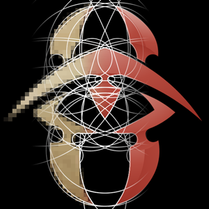
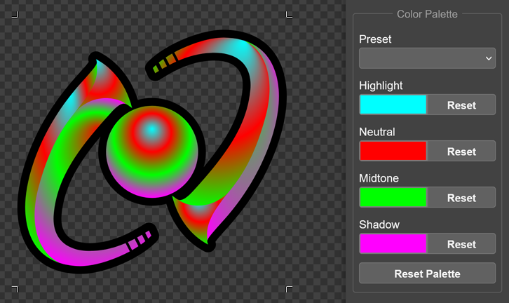
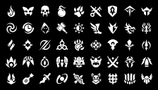

# GW2 Specialization Icons

<p align="center">
  
</p>

Vector recreations of the Guild Wars 2 specialization icons made by Matt Bryant.

The silhouettes are faithful to the official in-game icons. I have also included some stylization options to change the appearance of the icons:

<table>
  <tr>
    <th>Style</th>
    <th>Description</td>
    <th>Example</th>
  </tr>
  <tr>
    <th>Normal <i>(none)</i></th>
    <td>Icon appearance without any of the following style options</td>
    <td></td>
  <tr>
    <th>Outline</th>
    <td>Adds a black outline around the icon to increase contrast.</td>
    <td></td>
  </tr>
  <tr>
    <th>Shading</th>
    <td>Changes the icon from monochromatic to color gradients inspired by the official <i>“high res”</i> icons from ArenaNet.</td>
    <td></td>
  </tr>
  <tr>
    <th>Stroke</th>
    <td>Adds a dual stroke around the inside of the icon which mimics the appearance of the <a href='https://wiki.guildwars2.com/wiki/Category:Profession_tango_icons'><i>“tango icons”</i> from the GW2 wiki</a>.</td>
    <td></td>
  </tr>
</table>

You can choose any combination of the style options and you can even change the color(s) of the icons by selecting from a list of presets or defining your own color scheme by using the color pickers:

<figure align="center">
  
  <figcaption><small><i>Demonstration of a custom color palette applied to the Amalgam specialization icon</i></small></figcaption>
</figure>

When you are finished customizing the icon appearance, you can output the icon as a `.png` (rasterized) or `.svg` (vector).

## New *Tiny* Icons!

For each specialization icon, I have created a corresponding ***tiny*** version. These tiny icons are designed with some exaggerated proportions and extra negative space to improve visibility and make them easier to distinguish at *very* small sizes, such as inline with text.

<figure align="center">
  
  <figcaption><small><i>Tiny icons at 16×16 pixels</i></small></figcaption>
</figure>

These icons have optimal clarity at maximum contrast *(white icon on black background or vice versa)*

You can use these icons with your arcdps configuration by doing the following:

1. Create a folder called `icons` within your arcdps addon configuration folder:
  ```
  C:\Program Files\Guild Wars 2\addons\arcdps\icons
  ```

2. Inside that folder, add the icons with the following specific file names:

<table>
  <tr>
    <th>Profession</th>
    <th>Specialization</th>
    <th>File Name</th>
  </tr>
  <tr>
    <th rowspan="5">Guardian</th>
    <th>Guardian</th>
    <td><code>001.png</code></td>
  </tr>
  <tr>
    <th>Dragonhunter</th>
    <td><code>e101.png</code></td>
  </tr>
  <tr>
    <th>Firebrand</th>
    <td><code>e102.png</code></td>
  </tr>
  <tr>
    <th>Willbender</th>
    <td><code>e103.png</code></td>
  </tr>
  <tr>
    <th>Luminary</th>
    <td><code>e104.png</code></td>
  </tr>
  <tr>
    <th rowspan="5">Warrior</th>
    <th>Warrior</th>
    <td><code>002.png</code></td>
  </tr>
  <tr>
    <th>Berserker</th>
    <td><code>e201.png</code></td>
  </tr>
  <tr>
    <th>Spellbreaker</th>
    <td><code>e202.png</code></td>
  </tr>
  <tr>
    <th>Bladesworn</th>
    <td><code>e203.png</code></td>
  </tr>
  <tr>
    <th>Paragon</th>
    <td><code>e204.png</code></td>
  </tr>
  <tr>
    <th rowspan="5">Engineer</th>
    <th>Engineer</th>
    <td><code>003.png</code></td>
  </tr>
  <tr>
    <th>Scrapper</th>
    <td><code>e301.png</code></td>
  </tr>
  <tr>
    <th>Holosmith</th>
    <td><code>e302.png</code></td>
  </tr>
  <tr>
    <th>Mechanist</th>
    <td><code>e303.png</code></td>
  </tr>
  <tr>
    <th>Amalgam</th>
    <td><code>e304.png</code></td>
  </tr>
  <tr>
    <th rowspan="5">Ranger</th>
    <th>Ranger</th>
    <td><code>004.png</code></td>
  </tr>
  <tr>
    <th>Druid</th>
    <td><code>e401.png</code></td>
  </tr>
  <tr>
    <th>Soulbeast</th>
    <td><code>e402.png</code></td>
  </tr>
  <tr>
    <th>Untamed</th>
    <td><code>e403.png</code></td>
  </tr>
  <tr>
    <th>Galeshot</th>
    <td><code>e404.png</code></td>
  </tr>
  <tr>
    <th rowspan="5">Thief</th>
    <th>Thief</th>
    <td><code>005.png</code></td>
  </tr>
  <tr>
    <th>Daredevil</th>
    <td><code>e501.png</code></td>
  </tr>
  <tr>
    <th>Deadeye</th>
    <td><code>e502.png</code></td>
  </tr>
  <tr>
    <th>Specter</th>
    <td><code>e503.png</code></td>
  </tr>
  <tr>
    <th>Antiquary</th>
    <td><code>e504.png</code></td>
  </tr>
  <tr>
    <th rowspan="5">Elementalist</th>
    <th>Elementalist</th>
    <td><code>006.png</code></td>
  </tr>
  <tr>
    <th>Tempest</th>
    <td><code>e601.png</code></td>
  </tr>
  <tr>
    <th>Weaver</th>
    <td><code>e602.png</code></td>
  </tr>
  <tr>
    <th>Catalyst</th>
    <td><code>e603.png</code></td>
  </tr>
  <tr>
    <th>Evoker</th>
    <td><code>e604.png</code></td>
  </tr>
  <tr>
    <th rowspan="5">Mesmer</th>
    <th>Mesmer</th>
    <td><code>007.png</code></td>
  </tr>
  <tr>
    <th>Chronomancer</th>
    <td><code>e701.png</code></td>
  </tr>
  <tr>
    <th>Mirage</th>
    <td><code>e702.png</code></td>
  </tr>
  <tr>
    <th>Virtuoso</th>
    <td><code>e703.png</code></td>
  </tr>
  <tr>
    <th>Troubadour</th>
    <td><code>e704.png</code></td>
  </tr>
  <tr>
    <th rowspan="5">Necromancer</th>
    <th>Necromancer</th>
    <td><code>008.png</code></td>
  </tr>
  <tr>
    <th>Reaper</th>
    <td><code>e801.png</code></td>
  </tr>
  <tr>
    <th>Scourge</th>
    <td><code>e802.png</code></td>
  </tr>
  <tr>
    <th>Harbinger</th>
    <td><code>e803.png</code></td>
  </tr>
  <tr>
    <th>Ritualist</th>
    <td><code>e804.png</code></td>
  </tr>
  <tr>
    <th rowspan="5">Revenant</th>
    <th>Revenant</th>
    <td><code>009.png</code></td>
  </tr>
  <tr>
    <th>Herald</th>
    <td><code>e901.png</code></td>
  </tr>
  <tr>
    <th>Renegade</th>
    <td><code>e902.png</code></td>
  </tr>
  <tr>
    <th>Vindicator</th>
    <td><code>e903.png</code></td>
  </tr>
  <tr>
    <th>Conduit</th>
    <td><code>e904.png</code></td>
  </tr>
</table>